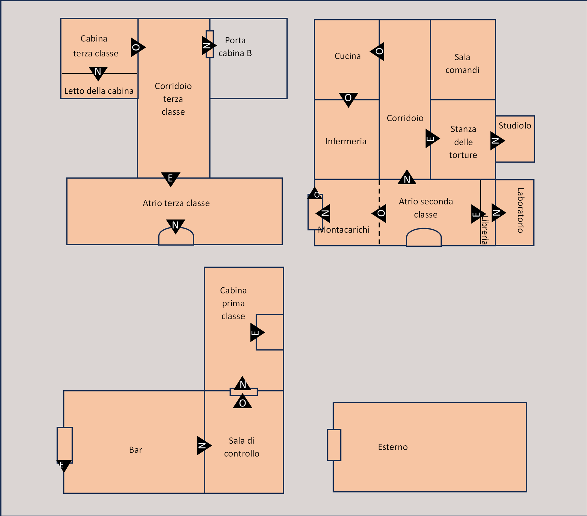
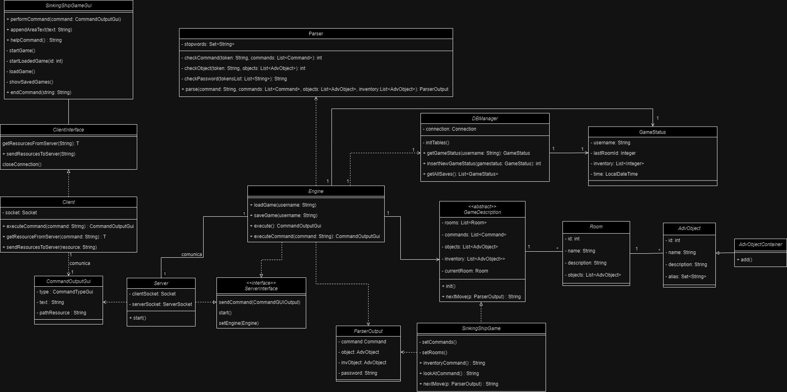
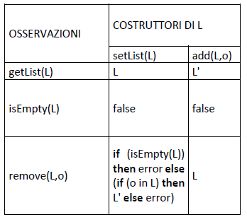

# MAPadventure

**Indice**
1. [Descrizione del caso di studio](#1--Descrizione-del-caso-di-studio)
2. [Istruzioni di gioco](#2--Istruzioni-di-gioco) 
2.1 [Avviamento programma](#2-1--Avviamento-programma) 
2.2 [Comandi di gioco](#2-2--Comandi-di-gioco) 
2.3 [Mappa di gioco](#2-3--Mappa-di-gioco) 
2.4 [Soluzione ottimale del gioco](#2-4--Soluzione-ottimale-del-gioco)
3. [Diagramma delle classi](#3--Diagramma-delle-classi)
4. [Specifica algebrica](#4--Specifica-algebrica)
5. [Applicazione argomenti](#5--Applicazione-argomenti)
  

## **1 	Descrizione del caso di studio**

“Desert the sinking ship” è un'applicazione Java che simula un'avventura testuale all'interno di una nave in procinto di affondare.
Scopo del gioco è riuscire a uscire dalla nave in tempo, prima che la stessa affondi completamente. Il giocatore deve essere dunque in grado di ispezionare con attenzione l'ambiente circostante, cercando di non tralasciare nulla durante il percorso e di compiere le scelte giuste.

Per progredire nel gioco, infatti, il giocatore dovrà utilizzare il proprio ingegno e la capacità di analizzare gli indizi presenti nelle descrizioni delle stanze e degli oggetti, al fine di sbloccare le stanze e di risolvere enigmi, cercando di non cascare nei tranelli.

## **2 	Istruzioni di gioco**
### **2-1  Avviamento programma**

Ti svegli all'interno di quella che sembra essere una cabina di una nave. Non hai idea di come ci sei arrivato ma una brutta sensazione ti pervade. Provi ad aprire la porta, ma ti accorgi che è chiusa a chiave. Cerca di uscirne vivo!

Per avviare il programma, è necessario eseguire due operazioni:

1. avviare il server eseguendo Engine, che crea e gestisce il server per la comunicazione client-server. (Questo ti permetterà di stabilire una connessione e scambiare dati tra il client e il server)

2. avviare il client eseguendo SinkingShipGameGui, che rappresenta l'interfaccia grafica del gioco. (Il client si connetterà al server precedentemente avviato e consentirà all'utente di giocare all'avventura testuale.)

### **2-2 Comandi di gioco**
Comandi di navigazione tra le stanze:

•	nord (oppure N): permette di spostarsi a nord;

•	sud (oppure S): permette di spostarsi a sud oppure di tornare nella stanza precedente;

•	est (oppure E): permette di spostarsi a est;

•	ovest (oppure O): permette di spostarsi a ovest.

Comandi di interazione con gli oggetti:

•	prendi [nome oggetto]: raccoglie un oggetto presente nella stanza e lo aggiunge all’inventario;

•	accendi [nome oggetto]: accende un oggetto come una lanterna;

•	ispeziona [nome oggetto]: ispeziona l'interno di un oggetto;

•	premi [nome oggetto]: preme un oggetto, come un pulsante;

•	sblocca [nome oggetto] "[password]": sblocca un oggetto attraverso una password;

•	sposta [nome oggetto]: sposta un oggetto;

•	usa [nome oggetto]: utilizza un oggetto.

Comandi generali:

•	inventario (oppure INV): mostra gli oggetti che hai raccolto;

•	osserva: descrive la stanza in cui ti trovi e gli oggetti al suo interno;

•	help: mostra una breve descrizione dell’obiettivo del gioco, seguita dall'elenco dei comandi disponibili, correlati di descrizione;

Comandi per terminare il gioco:

•	muori: termina il gioco per suicidio;

•	fuga: termina il gioco per tentativo di fuga;

•	io: termina il gioco per accoltellamento.

### **2-3 Mappa di gioco**
Il gioco si articola su quattro piani, di cui tutte le stanze, meno quella in grigio, sono visitabili. 

### **2-4 Soluzione ottimale del gioco**
•	PRENDI LAMPADA

•	N

•	SPOSTA CUSCINO

•	PRENDI CHIAVE

•	S

•	USA CHIAVE

•	O, E

•	SPOSTA CASSAPANCA

•	N, N, O, S

•	USA LAMPADA

•	O, O, N

•	PRENDI TRONCHESE

•	S, S, S

•	USA TRONCHESE

•	E

•	PRENDI OLIO

•	N

•	PRENDI LIBRO

•	ISPEZIONA LIBRO

•	S, S, S, E

•	USA LIBRO

•	N

•	PREMI PULSANTE

•	S, N, O

•	SBLOCCA TELEGRAFO “AGUF”

•	N, O

•	USA OLIO

•	N

•	SPOSTA TAPPETO

•	E

•	PRENDI CARTA

•	S, S, S, S

•	USA CARTA

•	E

•	PHI

  

## **3  Diagramma delle classi**

**Descrizione diagramma delle classi**

• Engine, gestisce l'esecuzione complessiva del gioco, si occupa di inizializzare e mantenere lo stato dello stesso gioco, gestire l'interazione tra le diverse componenti e fornire le funzionalità di base del gioco. Comunica con Parser, GameDescription e DBManager per ottenere le informazioni necessarie e controllare il flusso del gioco.

• Parser, responsabile di analizzare i comandi inseriti dal giocatore, fornisce l'output del parsing (rappresentazione strutturata per l'esecuzione del gioco) all'Engine, utilizzando algoritmi di parsing e tokenizzazione.

• DBManager, gestisce la connessione al database e fornisce funzionalità per inizializzare le tabelle necessarie, ottenere lo stato di gioco di un utente, inserire nuovi stati di gioco e recuperare quelli salvati. Comunica con l'Engine per fornire le informazioni sullo stato di gioco richieste e per memorizzare i nuovi stati di gioco.

• GameStatus, rappresenta lo stato di gioco di un utente (informazioni sul nome utente, l’ultima stanza corrente, l'inventario e il tempo di gioco).

• GameDescription, è una classe astratta che rappresenta la descrizione completa del gioco, inclusi i dettagli sulle stanze, i comandi disponibili, l'inventario e gli oggetti nel gioco. 
Viene estesa da SinkingShipGame e inizializzata dall'Engine all'avvio del gioco, fornisce metodi per gestire le azioni dei giocatori, come la gestione delle mosse e la gestione delle interazioni con l'ambiente di gioco.

• Room, rappresenta una stanza nel gioco, con gli attributi relativi e i metodi per accedere agli stessi.

• AdvObject, rappresenta un oggetto nel gioco, con gli attributi relativi e i metodi per accedere agli stessi.

• AdvObjectContainer, estende AdvObject e rappresenta un contenitore di oggetti nel gioco.

• SinkingShipGame, implementa la logica del gioco, con metodi per inizializzare comandi, stanze e gestire le azioni dei giocatori.

• Client e Server, gestiscono la comunicazione tra il gioco e gli utenti in un ambiente di rete locale.
La classe Client invia i comandi al Server riceve le risorse necessarie per l'esecuzione del gioco.
La classe Server, invece, gestisce le richieste dei client, avvia nuove istanze di gioco e coordina la comunicazione tra i client e il motore di gioco.

• ClientInterface, contiene i metodi fondamentali per garantire la comunicazione con il Server.

• ServerInterface, contiene i metodi fondamentali per garantire che il gioco rimanga in attesa di una richiesta del Client.

• SinkingShipGameGui, in JSwing, utilizzata per gestire l'interfaccia utente grafica del gioco. Fornisce i componenti grafici necessari per l'interazione con il giocatore.
Comunica con l'Engine per inviare comandi e ricevere output da visualizzare all'utente. È in grado di gestire azioni come l'esecuzione dei comandi, l'aggiornamento dell'output e la gestione degli eventi dell'interfaccia utente.

• CommandOutputGui, rappresenta l'output di un comando nell'interfaccia utente grafica del gioco.
Viene utilizzata per comunicare tra Client e SinkingShipGameGui.
  

## **4  Specifica algebrica**
Si prende in esame la struttura dati Lista della classe Inventory (con riferimento alla classe AdvObject), di conseguenza il metodo set è già inizializzato.

SPECIFICA SINTATTICA

**sorts**: List, TipoElem, Boolean

**operations**:

setList(List) -> List

getList(List) -> List

add(List, TipoElem) -> List

remove(List, TipoElem) -> List

isEmpty(List) -> Boolean

SPECIFICA SEMANTICA

**declare** L: List, o: TipoElem

getList(setList(L)) = L

add(setList(L), o) = L'

remove(add(setList(L), o), o) = L

remove(setList(L), o) = if (isEmpty(L)) then error else (if (o in L) then L' else error)

isEmpty(L) = if (L = <>) then true else false

isEmpty(setList(L)) = false (la lista passata è popolata)

isEmpty(remove(L, o)) = if isEmpty(L) then error else (if (L = <o>) then true else false)

SPECIFICA DI RESTRIZIONE

restrictions:

Si sono identificati i casi di errore specifica semantica (vedasi “isEmpty(remove(L, o))” e  “remove(setList(L), o)”).
  

## **5  Applicazione argomenti**
• File: utilizzati per caricare descrizioni, che fornisce dettagli sull’ambiente circostante e gli oggetti presenti con cui è possibile interagire, e titoli delle stanze.

• JBDC: utilizzata per la gestione dei salvataggi. Permette, infatti, di salvare lo stato di gioco, e tutte le informazioni relative.

• Thread: si utilizza un thread per gestire il timer, aggiornando la JProgressBar della GUI, e un altro che resta in ascolto per rilevare la progressione del livello dell’acqua e gestirne i relativi comportamenti. 

• Socket: utilizzati per implementare un'architettura client-server. La comunicazione tra server e client è infatti resa possibile attraverso socket nello scambio di dati e comandi.

• SWING: utilizzata per creare un'interfaccia grafica interattiva e consentire all'utente di interagire con il gioco, rendendo l’esperienza più coinvolgente.

• Lambda expression: utilizzate per rendere il codice più leggibile, efficiente e conciso rispetto all'utilizzo di classi interne o anonime e per ridurre la quantità di codice di supporto necessario.
Vengono utilizzate ad esempio nel controllo della presenza di un oggetto dell'inventario nella lista degli oggetti del gioco, o in metodi relativi agli action listener della GUI.

• Interfacce: utilizzate le interfacce per garantire una possibile scalabilità del modo in cui avviene la comunicazione Client-Server. Si utilizzano anche per permettere l’implementazione del design pattern strutturale Remote Facade, che fornisce un'interfaccia semplificata per l'interazione con un sottosistema complesso, nascondendo i dettagli di implementazione e semplificando l'uso del sistema remoto. Il Server svolge il ruolo di Remote Facade, esponendo un'interfaccia semplice per i client, consentendo loro di inviare comandi e ricevere risorse di gioco e gestendo l'elaborazione delle richieste dei client (avviando nuove istanze di gioco e coordinando la comunicazione tra il client e l'Engine).

• Generics: utilizzate per generalizzare la richiesta di risorse al Server da parte del Client.
